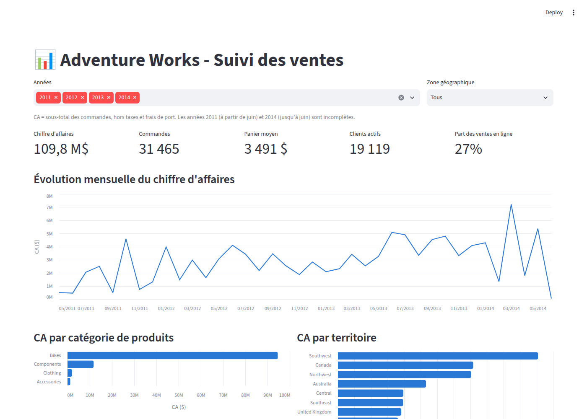

# Projet Adventure Works - Optimisation des Opérations Commerciales

La direction d'Adventure Works cherche à améliorer ses opérations commerciales et augmenter ses ventes. Cela nécessite des informations détaillées sur les ventes, les produits et les clients afin de prendre des décisions éclairées. L'équipe data d'Adventure Works avait déjà mis en place les bases de la gestion des données en créant une base de données opérationnelle (OLTP) et un entrepôt de données (datawarehouse). Cependant, le projet a été interrompu car l'ingénieur data et l'analyste data ont été recrutés par Google.

Vous avez été embauché pour reprendre et compléter le travail commencé par l'équipe précédente.

## Tâches à réaliser

### 1) Récupération et configuration des données

- Restaurer les bases de données à partir des fichiers de sauvegarde (.bak) : AdventureWorks2019.bak et AdventureWorksDW2019.bak.
- Configurer les bases de données en local.
- Utiliser un outil pour se connecter aux bases de données.
- Créer un diagramme entité-relation (ERD) pour visualiser la structure des données.
- Expliquer le rôle de chaque base de données, leur utilité et leur lien entre elles.
- Introduire le concept d'ETL (Extract, Transform, Load).
- Définir les termes : OLTP, OLAP, DataWarehouse, DataLake, DataMart et DataMesh.

### 2) Requêtes SQL pour l'OLTP

- Convertir 100 problématiques récurrentes de l'équipe BI en requêtes SQL.
- Sauvegarder ces requêtes dans un script.
- Réaliser les 50 premières requêtes en SQL pour démontrer vos compétences.

### 3) Déploiement de la base de données sur Azure (DataWarehouse)

- Déployer la base de données sur Azure en utilisant une méthode au choix (instance de conteneur ou Azure SQL Databases).
- Si Azure SQL Databases est choisi, valider la configuration avec le responsable pour éviter des coûts élevés.

### 4) Création d'un tableau de bord

- Concevoir un tableau de bord pour l'équipe de direction permettant de suivre les activités de l'entreprise.
- Utiliser les requêtes SQL précédemment créées comme base pour le tableau de bord.
- Choix des technologies pour le tableau de bord : Django, PowerBI, Streamlit, etc.

## Objectifs

- Terminer la mise en place des bases de données OLTP et DataWarehouse.
- Réaliser des requêtes SQL pour répondre aux besoins opérationnels (OLTP).
- Déployer la base de données sur Azure en respectant les contraintes budgétaires (DataWarehouse).
- Créer un tableau de bord fonctionnel pour le suivi d'activité de l'entreprise.

# Réalisation

| Partie | Livrable |
|---|---|
| 1) Récupération et configuration des données | [`Dockerfile`](Dockerfile) (restauration des deux bases) et [`docs/01-bases-de-donnees.md`](docs/01-bases-de-donnees.md) : connexion, rôle des bases, ERD, ETL, définitions |
| 2) Requêtes SQL pour l'OLTP | [`sql/Script.sql`](sql/Script.sql) : les 50 premières requêtes |
| 3) Déploiement sur Azure | [`docs/03-deploiement-azure.md`](docs/03-deploiement-azure.md) : image publiée sur Docker Hub et déployée dans Azure Container Instances |
| 4) Tableau de bord | [`dashboard/`](dashboard) : application Streamlit connectée à la base OLTP |

## Lancer le projet

Les fichiers `.bak` ne sont pas versionnés : le Dockerfile les télécharge directement depuis les [releases Microsoft](https://github.com/Microsoft/sql-server-samples/releases/tag/adventureworks).

### Base de données et tableau de bord (Docker Compose)

```bash
cp .env.example .env      # puis choisir un mot de passe SA dans .env
docker compose up --build
```

- Tableau de bord : http://localhost:8501
- SQL Server : `localhost,1433`, utilisateur `sa` (DBeaver, Azure Data Studio...)

Le premier lancement télécharge l'image SQL Server et les sauvegardes (environ 2 Go), puis restaure les deux bases.

### Base de données seule

Le mot de passe SA est fourni au moment du build (il doit respecter la politique de complexité de SQL Server) :

```bash
docker build --build-arg MSSQL_SA_PASSWORD=<mot_de_passe> -t olaffsen/mssqlserver:adventureworks2019 .
docker run -p 1433:1433 --name mssqlserver --hostname mssqlserver olaffsen/mssqlserver:adventureworks2019
```

## Tableau de bord

Le tableau de bord suit l'activité commerciale à partir de la base OLTP, avec des requêtes dérivées de celles de [`sql/Script.sql`](sql/Script.sql) (voir [`dashboard/queries.py`](dashboard/queries.py)) :

- indicateurs clés : chiffre d'affaires, nombre de commandes, panier moyen, clients actifs, part des ventes en ligne ;
- évolution mensuelle du chiffre d'affaires ;
- répartition par catégorie de produits et par territoire ;
- top 10 des produits et des vendeurs ;
- filtres par année et par zone géographique, et données consultables sous forme de tableaux.



Pour le lancer sans Docker (base déjà démarrée) :

```bash
cd dashboard
pip install -r requirements.txt
DB_PASSWORD=<mot_de_passe> streamlit run app.py
```

Sous Windows (PowerShell) : `$env:DB_PASSWORD="<mot_de_passe>"; streamlit run app.py`.

Variables disponibles : `DB_HOST` (défaut `localhost`), `DB_PORT` (`1433`), `DB_USER` (`sa`), `DB_PASSWORD`, `DB_NAME` (`AdventureWorks2019`). Pour se connecter à l'instance Azure, indiquer son adresse dans `DB_HOST`.
