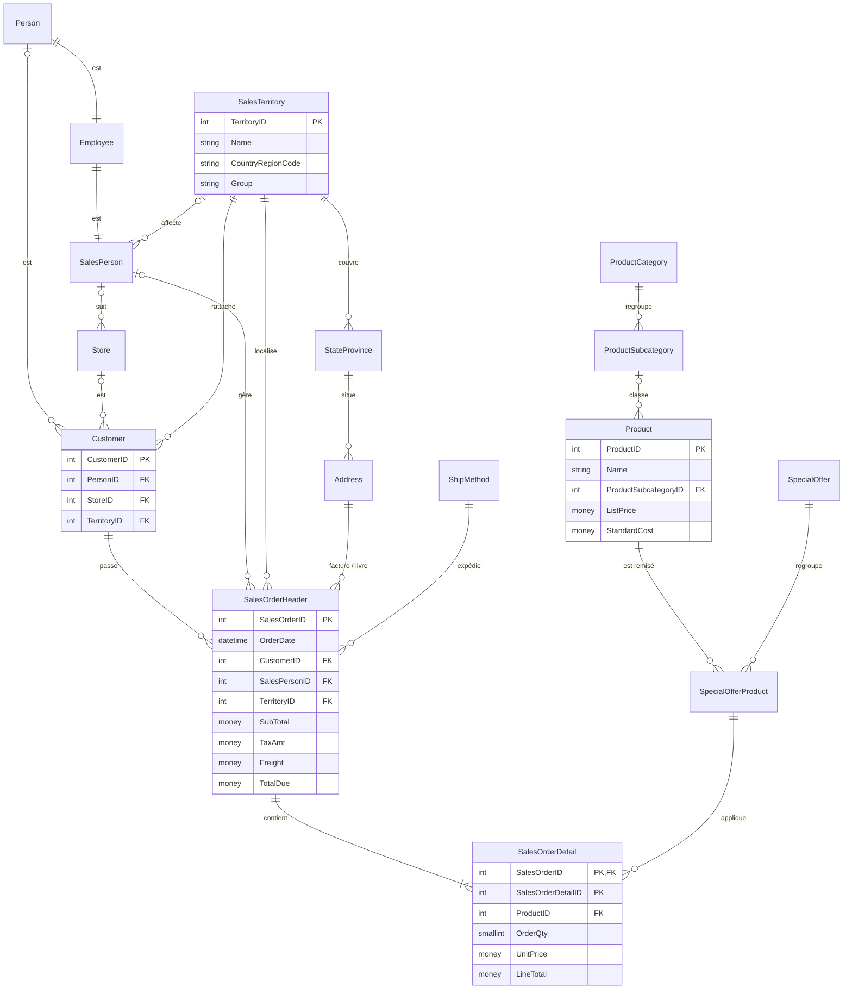
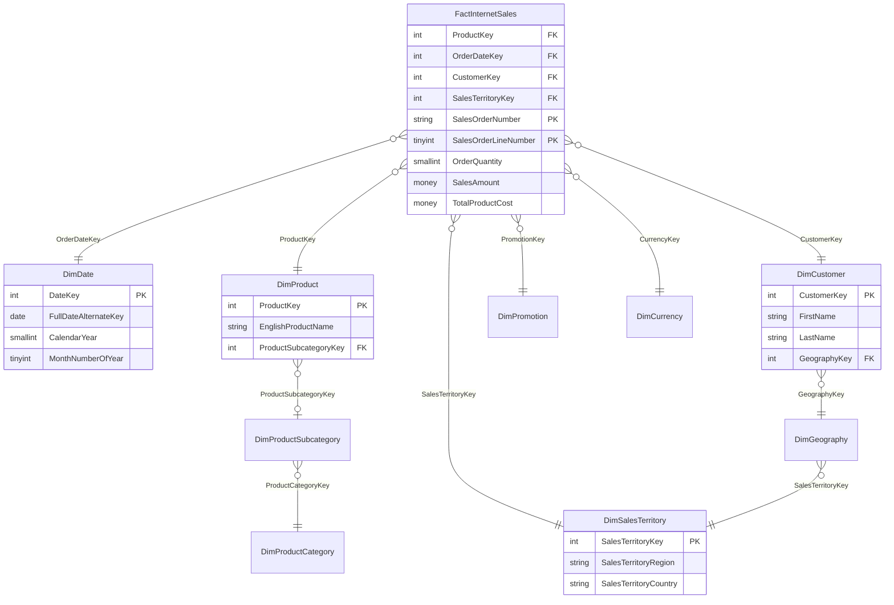

# 1) Récupération et configuration des données

## Restauration et connexion

Les deux bases sont restaurées automatiquement au premier démarrage du conteneur (script [`docker/restore-databases.sh`](../docker/restore-databases.sh)), à partir des sauvegardes officielles Microsoft incluses dans l'image :

| Base | Type | Contenu |
|---|---|---|
| `AdventureWorks2019` | OLTP | 71 tables réparties en 6 schémas (`Sales`, `Production`, `Person`, `HumanResources`, `Purchasing`, `dbo`) |
| `AdventureWorksDW2019` | DataWarehouse (OLAP) | 31 tables : tables de faits (`Fact*`) et de dimensions (`Dim*`) |

```bash
docker run -d -e MSSQL_SA_PASSWORD=<mot_de_passe> -p 1433:1433 --name adventureworks-db olaffsen/adventureworks-db
docker logs -f adventureworks-db    # attendre « AdventureWorksDW2019 restaurée »
```

Connexion avec DBeaver (ou Azure Data Studio, SSMS) :

| Paramètre | Valeur |
|---|---|
| Hôte | `localhost` |
| Port | `1433` |
| Utilisateur | `sa` |
| Mot de passe | celui passé dans `MSSQL_SA_PASSWORD` |
| Option | cocher *Trust server certificate* |

## Rôle de chaque base et lien entre elles

### AdventureWorks2019 : la base opérationnelle (OLTP)

C'est la base utilisée au quotidien par les applications de l'entreprise : prise de commande, gestion des stocks, des clients, des employés, des fournisseurs. Elle est **normalisée** (chaque information n'est stockée qu'une fois, réparties sur de nombreuses tables reliées par des clés étrangères) pour garantir la cohérence des données lors des nombreuses écritures.

| Schéma | Domaine |
|---|---|
| `Sales` | commandes, clients, vendeurs, territoires, magasins |
| `Production` | produits, catégories, stocks, nomenclatures |
| `Person` | personnes, adresses, contacts |
| `HumanResources` | employés, départements, historique des salaires |
| `Purchasing` | fournisseurs, commandes d'achat, modes de livraison |

Les données de ventes couvrent la période de mai 2011 à juin 2014 (31 465 commandes, 121 317 lignes de commande).

### AdventureWorksDW2019 : l'entrepôt de données (DataWarehouse)

C'est la base dédiée à l'**analyse**. Les données y sont **dénormalisées** et organisées en **schéma en étoile** : une table de faits centrale (les mesures : montants, quantités) entourée de tables de dimensions (les axes d'analyse : date, produit, client, géographie). Ce modèle réduit le nombre de jointures et accélère les agrégations utilisées par les tableaux de bord.

Les principales tables de faits sont `FactInternetSales` (ventes en ligne aux particuliers, 60 398 lignes) et `FactResellerSales` (ventes aux revendeurs, 60 855 lignes).

### Lien entre les deux bases

Le DataWarehouse est **alimenté à partir de l'OLTP** par un processus ETL : les commandes de `Sales.SalesOrderHeader` / `Sales.SalesOrderDetail` deviennent des lignes de `FactInternetSales` ou `FactResellerSales`, les tables `Production.Product*` sont aplaties dans `DimProduct`, `Person.Person` + `Sales.Customer` dans `DimCustomer`, etc.

| OLTP (`AdventureWorks2019`) | DataWarehouse (`AdventureWorksDW2019`) |
|---|---|
| `Sales.SalesOrderHeader` + `Sales.SalesOrderDetail` | `FactInternetSales`, `FactResellerSales` |
| `Production.Product`, `ProductSubcategory`, `ProductCategory` | `DimProduct`, `DimProductSubcategory`, `DimProductCategory` |
| `Sales.Customer` + `Person.Person` | `DimCustomer` |
| `Sales.Store` | `DimReseller` |
| `Person.Address`, `StateProvince`, `CountryRegion` | `DimGeography` |
| `Sales.SalesTerritory` | `DimSalesTerritory` |
| `HumanResources.Employee` | `DimEmployee` |
| `OrderDate` (colonne) | `DimDate` (table calendrier) |

> Les deux bases sont des jeux d'exemple indépendants : les périodes ne se recouvrent pas exactement (OLTP : 2011-2014, DW : fin 2010-2014) et les volumes diffèrent légèrement.

## Diagrammes entité-relation (ERD)

Les bases complètes comptent plus de 100 tables. Les diagrammes ci-dessous se concentrent sur la partie **ventes**, utilisée par les requêtes et le tableau de bord. Ils sont générés à partir des clés étrangères réelles des bases (`sys.foreign_keys`).

### OLTP : processus de vente



### DataWarehouse : schéma en étoile des ventes Internet



`FactResellerSales` suit le même modèle, avec en plus les dimensions `DimReseller` (revendeur) et `DimEmployee` (vendeur).

## Concepts

### ETL (Extract, Transform, Load)

Processus qui alimente un entrepôt de données à partir des sources opérationnelles :

1. **Extract** : extraire les données des sources (bases OLTP, fichiers, API). Ex. : lire les nouvelles commandes de `Sales.SalesOrderHeader`.
2. **Transform** : nettoyer, convertir, enrichir et restructurer. Ex. : remplacer `OrderDate` par une clé `OrderDateKey` (format `AAAAMMJJ`), aplatir produit / sous-catégorie / catégorie, calculer les marges.
3. **Load** : charger le résultat dans les tables de faits et de dimensions du DataWarehouse.

L'ETL tourne généralement de façon planifiée (chaque nuit, par exemple), avec des outils comme SSIS, Azure Data Factory, Airflow ou des scripts Python. La variante **ELT** charge d'abord les données brutes puis les transforme directement dans l'entrepôt (approche courante dans le cloud).

### Définitions

| Terme | Définition |
|---|---|
| **OLTP** (*Online Transaction Processing*) | Système conçu pour un grand nombre de petites transactions (insertions, mises à jour) en temps réel. Données normalisées, priorité à la cohérence et à la rapidité d'écriture. Ex. : `AdventureWorks2019`. |
| **OLAP** (*Online Analytical Processing*) | Système conçu pour analyser de gros volumes de données historiques avec des requêtes d'agrégation complexes (par période, produit, région...). Données dénormalisées, priorité à la rapidité de lecture. Ex. : `AdventureWorksDW2019`. |
| **DataWarehouse** (entrepôt de données) | Base centrale qui rassemble des données historisées, nettoyées et structurées (souvent en étoile) provenant de plusieurs sources, pour le reporting et l'aide à la décision. |
| **DataLake** (lac de données) | Espace de stockage de données brutes dans leur format d'origine (structurées, semi-structurées comme JSON, ou non structurées comme des images), à bas coût et à grande échelle. Le schéma est appliqué à la lecture. Ex. : Azure Data Lake Storage. |
| **DataMart** | Sous-ensemble d'un DataWarehouse dédié à un métier ou un service (ventes, finance, RH). Plus petit et plus simple à interroger. Ex. : un DataMart « Ventes » limité à `FactInternetSales` et ses dimensions. |
| **DataMesh** | Approche d'organisation (plutôt qu'une technologie) où chaque domaine métier est propriétaire de ses données et les expose comme des « produits de données », avec une gouvernance commune. Elle décentralise la responsabilité au lieu de tout centraliser dans une équipe data. |
